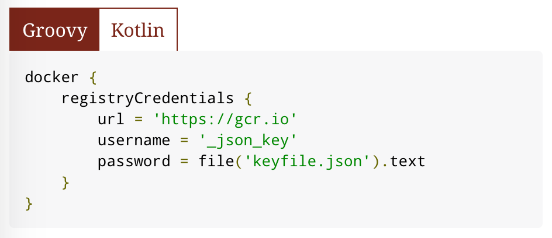
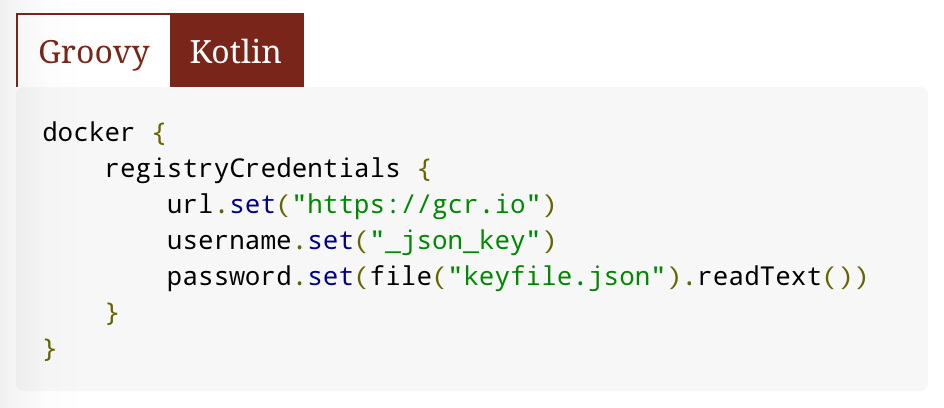

= AsciidoctorJ tabbed code extension

This AsciidoctorJ extension can render code on multiple tabs. The functionality is particularly useful if you want to demonstrate a code example in different languages or tools, as shown in the following two images.

[.float-group]
--
[.left]
.Groovy tab

[.right]
.Kotlin tab

--

== Using the extension

All you need to do to use the extension is to add it to the https://bintray.com/bmuschko/maven/asciidoctorj-tabbed-code-extension[dependency from JCenter]. The following two example demonstrate the use of version 0.1 from Maven and Gradle.

.Maven
[source,xml]
----
<dependency>
    <groupId>com.bmuschko</groupId>
    <artifactId>asciidoctorj-tabbed-code-extension</artifactId>
    <version>0.1</version>
</dependency>
----

.Gradle
[source,groovy]
----
dependencies {
    compile 'com.bmuschko:asciidoctorj-tabbed-code-extension:0.1'
}
----

[IMPORTANT]
This extension is based on AsciidoctorJ version 1.6.0-RC1. Make sure that the consuming project uses that exact version to avoid incompatibilities. The alpha versions 1.6.0 of AsciidoctorJ are not compatible.

To use the extension in Asciidoc provide code blocks with different roles. The extension uses the title of the code block for rendering the tab label.

[source]
....
[source,groovy,indent=0,subs="verbatim,attributes",role="primary"]
.Groovy
----
docker {
    registryCredentials {
        url = 'https://gcr.io'
        username = '_json_key'
        password = file('keyfile.json').text
    }
}
----

[source,kotlin,indent=0,subs="verbatim,attributes",role="secondary"]
.Kotlin
----
docker {
    registryCredentials {
        url.set("https://gcr.io")
        username.set("_json_key")
        password.set(file("keyfile.json").readText())
    }
}
----
....

== Configuring the extension

Under the hood, the extension uses the JavaScript library https://zeptojs.com/[Zepto.js]. Currently, the JavaScript library is not configurable.

By default, the extension provides a JavaScript and CSS file that already takes care of the runtime behavior and styling. The runtime behavior and styling is configurable. The table below shows the attributes that allow you to configure the extension.

|===
|Attribute              |Default Value          |Description
|`tabbed-code-js-path`  |https://github.com/bmuschko/asciidoctorj-tabbed-code-extension/blob/master/src/main/resources/codeBlockSwitch.js[`/codeBlockSwitch.js`] |The JavaScript controlling the behavior read from the runtime classpath.
|`tabbed-code-css-path` |https://github.com/bmuschko/asciidoctorj-tabbed-code-extension/blob/master/src/main/resources/codeBlockSwitch.css[`/codeBlockSwitch.css`] |The CSS controlling the styling read from the runtime classpath.
|===

The following example shows how to use the CSS attributes to provide custom styling in a Gradle build using the Kotlin DSL.

.build.gradle.kts
[source,kotlin]
----
tasks.named<AsciidoctorTask>("asciidoctor") {
    sourceDir = file("src/docs/asciidoc")
    sources(delegateClosureOf<PatternSet> {
        include("index.adoc")
    })

    attributes(
        mapOf(
            "toc" to "left",
            "source-highlighter" to "prettify",
            "icons" to "font",
            "numbered" to "",
            "idprefix" to "",
            "docinfo1" to "true",
            "sectanchors" to "true",
            "tabbed-code-css-path" to "/customTabbedCode.css"
        )
    )
}
----

